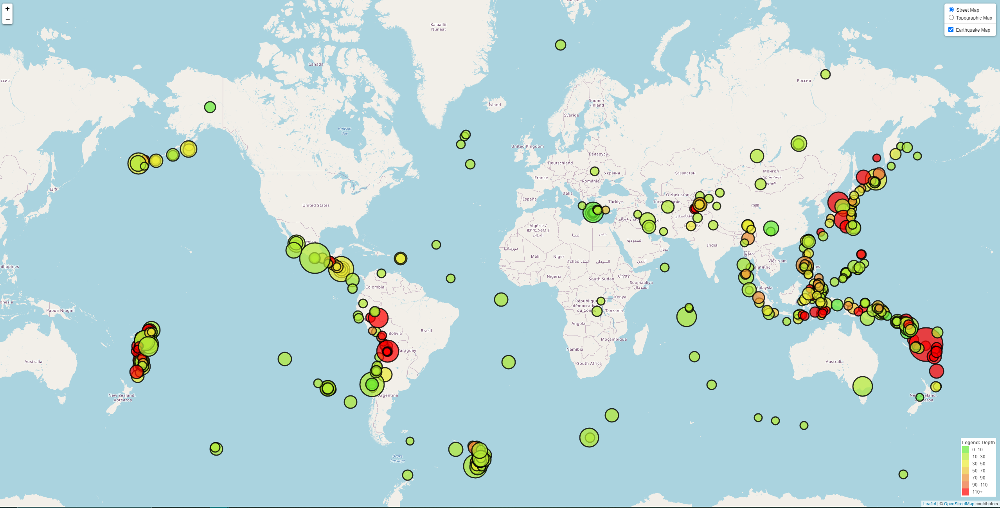

# GT Bootcamp Leaflet Homework: Earthquakes

## Table of Contents
1. [Introduction](#introduction)
2. [Objectives](#objectives)
3. [Technologies & Sources](#technologies)
4. [Files & Links](#files)

### Introduction
As a new member of the United States Geological Survey (USGS), I have been tasked with building an map that allows the team to visualize their earthquake data.

### Objectives
Visualize a selected earthquake dataset by:
* Picking a dataset from the [USGS GeoJSON feed](https://earthquake.usgs.gov/earthquakes/feed/v1.0/geojson.php)
* Creating a map using Leaflet the plots all earthquake locations
* Adjusting marker size using the magnitude value
* Adjusting marker color using the depth value
* Adding popups that provide magnitude, location, and depth of the earthquake
* Creating a legend that gives meaning to the marker color
* Adding layer controls

### Technologies & Sources
This project uses: 
* Javascript
* CSS
* HTML
* D3.json
* Leaflet

### Files & Links

* [Selected Data](https://earthquake.usgs.gov/fdsnws/event/1/query?format=geojson&minmagnitude=4.5): GeoJSON data used for my map (earthquakes over last 30 days with a minimum magnitude of 4.5)
* [Javascript File](static/js/logic.js): file containing all javascript code used for reading in the GeoJSON data and creating the map using Leaflet
* [Style File](static/css/style.css): style for map page
* [Map HTML](index.html): HTML for the map page, which is created using Leaflet, D3, and Javascript dynamic coding
* [Live Site](https://khutula.github.io/leaflet-challenge/): location of the live site

#### Screenshot of Map Webpage
